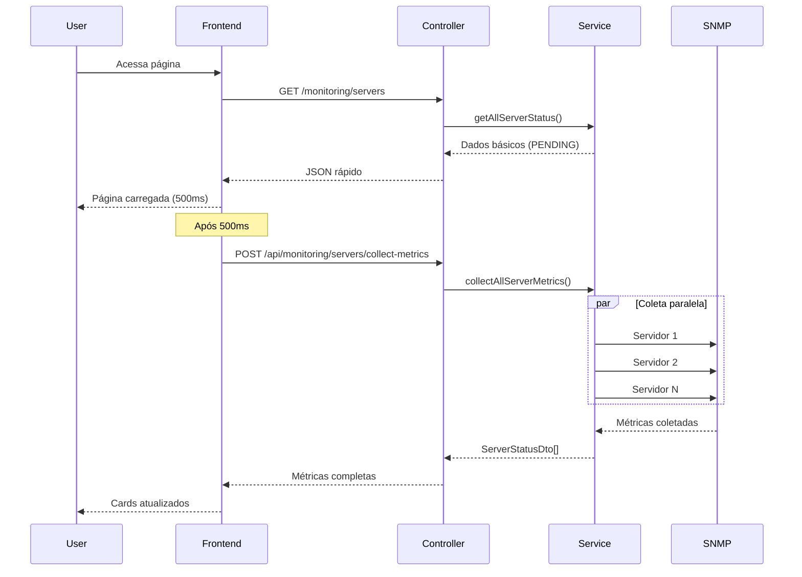

# Otimização de Performance - ServerWatch

## 🚀 Objetivo

Resolver o problema de lentidão no carregamento das páginas de monitoramento, removendo a coleta automática de métricas SNMP durante o acesso às páginas e implementando um sistema de coleta sob demanda via API.

## 📊 Problema Identificado

Anteriormente, o sistema coletava métricas SNMP de todos os servidores **de forma síncrona** sempre que o usuário acessava as páginas de monitoramento, causando:

- ⏱️ Tempo de carregamento lento (dependia da resposta SNMP de todos os servidores)
- 🔄 Bloqueio da interface durante a coleta
- 📉 Experiência do usuário comprometida

## ✅ Solução Implementada

### 1. **Carregamento Rápido da Página**
- Páginas agora carregam **instantaneamente** com dados básicos dos servidores
- Status inicial `PENDING` com indicador visual de carregamento
- Dados básicos (nome, IP, tipo, localização) são exibidos imediatamente

### 2. **Coleta de Métricas em Background**
- Métricas são coletadas **após** o carregamento da página (via JavaScript)
- Processo **assíncrono** que não bloqueia a interface
- Cards são atualizados progressivamente conforme as métricas chegam

### 3. **Monitoramento Agendado Mantido**
- Sistema continua executando verificações automáticas para **alertas**
- Monitoramento em background para detectar problemas
- Cache de métricas para consultas rápidas

## 🔧 Alterações Técnicas

### Backend (Java)

#### `ServerMonitoringService.java`
```java
// Método otimizado para retorno rápido
public List<ServerStatusDto> getAllServerStatus() {
    // Retorna dados básicos ou cache sem bloquear
    // Status PENDING para servidores não verificados
}

// Novo método para coleta sob demanda
public List<ServerStatusDto> collectAllServerMetrics() {
    // Executa coleta SNMP em paralelo
    // Atualiza cache para consultas futuras
}
```

#### `MonitoringApiController.java`
```java
// Novo endpoint para coleta de métricas
@PostMapping("/servers/collect-metrics")
public ResponseEntity<List<ServerStatusDto>> collectAllServerMetrics() {
    // API para coleta sob demanda via JavaScript
}
```

### Frontend (JavaScript)

#### `monitoring-servers.js`
```javascript
// Carregamento otimizado
document.addEventListener('DOMContentLoaded', function() {
    loadServersList();           // Carrega dados básicos (rápido)
    setTimeout(collectServerMetrics, 500); // Coleta métricas após 500ms
});

// Coleta métricas via API
async function collectServerMetrics() {
    // Faz chamada POST para /api/monitoring/servers/collect-metrics
    // Atualiza cards progressivamente
}
```

### CSS

#### `monitoring-servers.css`
```css
/* Novos estilos para status PENDING */
.server-card.pending { border-left-color: #17a2b8; }
.status-pending { background-color: #17a2b8; }
.metrics-loading { animation: pulse 2s infinite; }
```

## 📈 Benefícios

### Performance
- 🚀 **Carregamento instantâneo** das páginas (< 1s)
- ⚡ **Não-bloqueante** - interface responde imediatamente
- 📊 **Métricas progressivas** - dados aparecem conforme disponíveis

### Experiência do Usuário
- 👀 **Feedback visual** com spinners e status "Carregando..."
- 🔄 **Updates em tempo real** sem refresh da página
- 📱 **Interface responsiva** durante a coleta

### Confiabilidade
- 🛡️ **Monitoramento mantido** para alertas críticos
- 💾 **Cache inteligente** para consultas rápidas
- ⚠️ **Tratamento de erros** gracioso

## 🎯 Fluxo Otimizado



## 🔍 Monitoramento

O sistema mantém duas camadas de monitoramento:

1. **Coleta Sob Demanda** (Performance)
   - Via API REST quando usuário acessa páginas
   - Não bloqueia interface
   - Dados frescos para visualização

2. **Monitoramento Agendado** (Alertas)
   - Execução automática em background
   - Detecção de problemas críticos
   - Geração de alertas em tempo real

## 📝 Logs de Performance

```
2025-10-15 10:58:16 INFO: API: Iniciando coleta sob demanda de métricas para todos os servidores
2025-10-15 10:58:17 INFO: API: Métricas coletadas com sucesso para 5 servidores
```

## 🚀 Próximos Passos

- [ ] **WebSockets** para updates em tempo real
- [ ] **Paginação** para listas grandes de servidores
- [ ] **Cache Redis** para alta disponibilidade
- [ ] **Métricas por demanda** individual por servidor